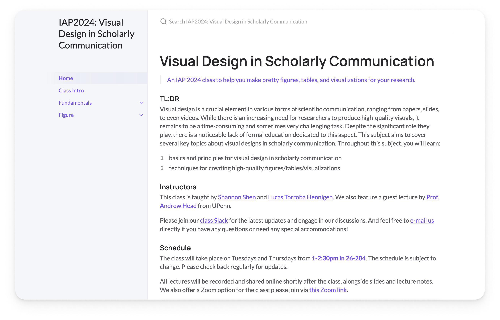

## IAP 2024 Visual Design in Scholarly Communication Class Website



This repo is modified based on the [just-the-docs](https://github.com/just-the-docs/just-the-docs) code base. We customize the theme and add some features to make it suitable for our ckass.


## Install and start locally

```bash
bundle install
bundle exec jekyll serve
```